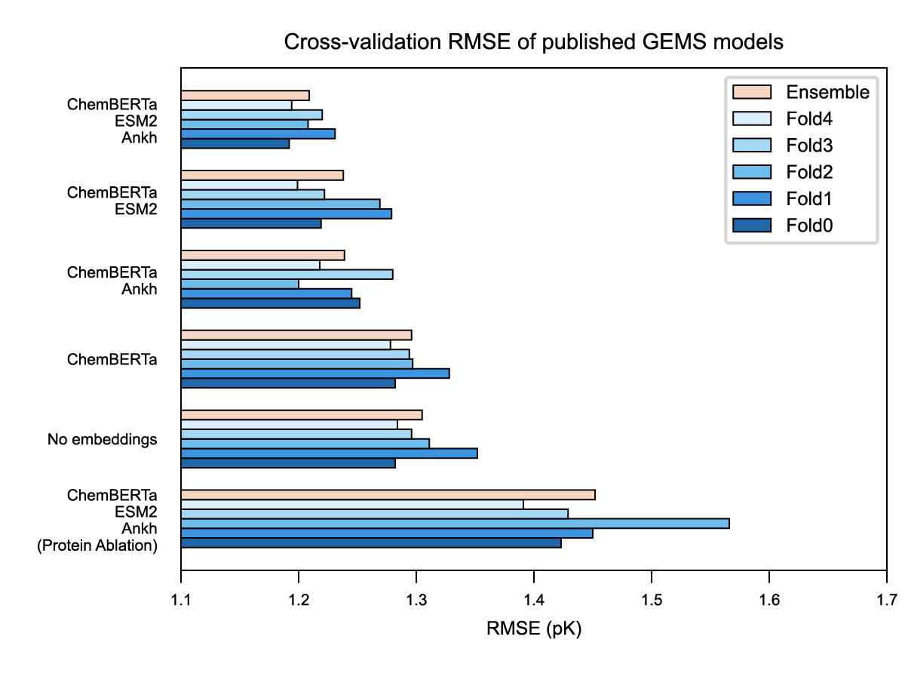

## PDBbind CleanSplit and GEMS
PDBbind CleanSplit is a refined training dataset for binding affinity prediction models that is based on PDBbind and has been filtered to reduce redundancy and train-test data leakage into the CASF benchmark datasets. The composition of PDBbind CleanSplit can be found in `PDBbind_data/PDBbind_data_split_cleansplit.json`. 

### Preprocessed datasets on Zenodo
We provide PyTorch datasets of precomputed interaction graphs for the following datasets on [Zenodo](https://doi.org/10.5281/zenodo.15482796):

* **PDBbind database v.2020 (excluding CASF complexes)** --> `train_pdbbind`
* **PDBbind CleanSplit** --> `train_cleansplit`
* **CASF2016 benchmark** --> `casf2016`
* **Independent subset of CASF2016** --> `casf2016_indep`
* **CASF2013 benchmark** --> `casf2013`
* **Independent subset of CASF2013** --> `casf2013_indep`

Each PyTorch dataset is available in five versions containing different combinations of language model embeddings in the graph features:

* `00AEPL` -  ChemBERTa-77M included
* `B0AEPL` -  ChemBERTa-77M and ankh_base included
* `06AEPL` -  ChemBERTa-77M and ESM2-T6 included
* `B6AEPL` -  ChemBERTa-77M, ankh_base and ESM2-T6 included
* `B6AE0L` -  ChemBERTa-77M, ankh_base and ESM2-T6 included (**Ablation:** protein nodes deleted)
 

### Pretrained models on GitHub
In addition, we provide GEMS models that have been trained on CleanSplit with each of these combinations of language model embeddings: 
* `model/GEMS18e_00AEPL_kikdic_d0100` - No embedding included (trained with GEMS18e architecture, neglects ChemBERTa)
* `model/GEMS18d_00AEPL_kikdic_d0200` - ChemBERTa-77M included
* `model/GEMS18d_B0AEPL_kikdic_d0600` - ChemBERTa-77M and ankh_base included
* `model/GEMS18d_06AEPL_kikdic_d0600` - ChemBERTa-77M and ESM2-T6 included
* `model/GEMS18d_B6AEPL_kikdic_d0500` - ChemBERTa-77M, ankh_base and ESM2-T6 included
* `model/GEMS18d_B6AE0L_kikdic_d0100` - ChemBERTa-77M, ankh_base and ESM2-T6 (**Ablation:** protein nodes deleted from graph)
 

### Training of the models
Below you can see on which dataset the provided models were trained:

| Identifier        | Model                        | Trained on Dataset         | Embeddings                           | 
| :----------------                     | :------                     | :-----------------        | :----------------                   |
| GEMS18**e**_00AEPL                    | `GEMS18e_00AEPL_kikdic_d0100` | `00AEPL_train_cleansplit`  | None                              |
| GEMS18**d**_00AEPL                    | `GEMS18d_00AEPL_kikdic_d0200` | `00AEPL_train_cleansplit`  | ChemBERTa-77M                     |
| GEMS18d_**B0**AEPL                    | `GEMS18d_B0AEPL_kikdic_d0600` | `B0AEPL_train_cleansplit`  | ChemBERTa-77M, ankh_base          |
| GEMS18d_**06**AEPL                    | `GEMS18d_06AEPL_kikdic_d0600` | `06AEPL_train_cleansplit`  | ChemBERTa-77M, ESM2-T6            |
| GEMS18d_**B6**AEPL                    | `GEMS18d_B6AEPL_kikdic_d0500` | `B6AEPL_train_cleansplit`  | ChemBERTa-77M, ankh_base, ESM2-T6 |
| GEMS18d_B6AE**0**L (**Protein Ablation**) | `GEMS18d_B6AE0L_kikdic_d0100` | `B6AE0L_train_cleansplit`  | ChemBERTa-77M, ankh_base, ESM2-T6 |
 

### Performance of the models
For each model, we provide five stdicts corresponding to the models originating from 5-fold cross-validation. Depending on the language model embeddings incorporated, these model showed different performance:

